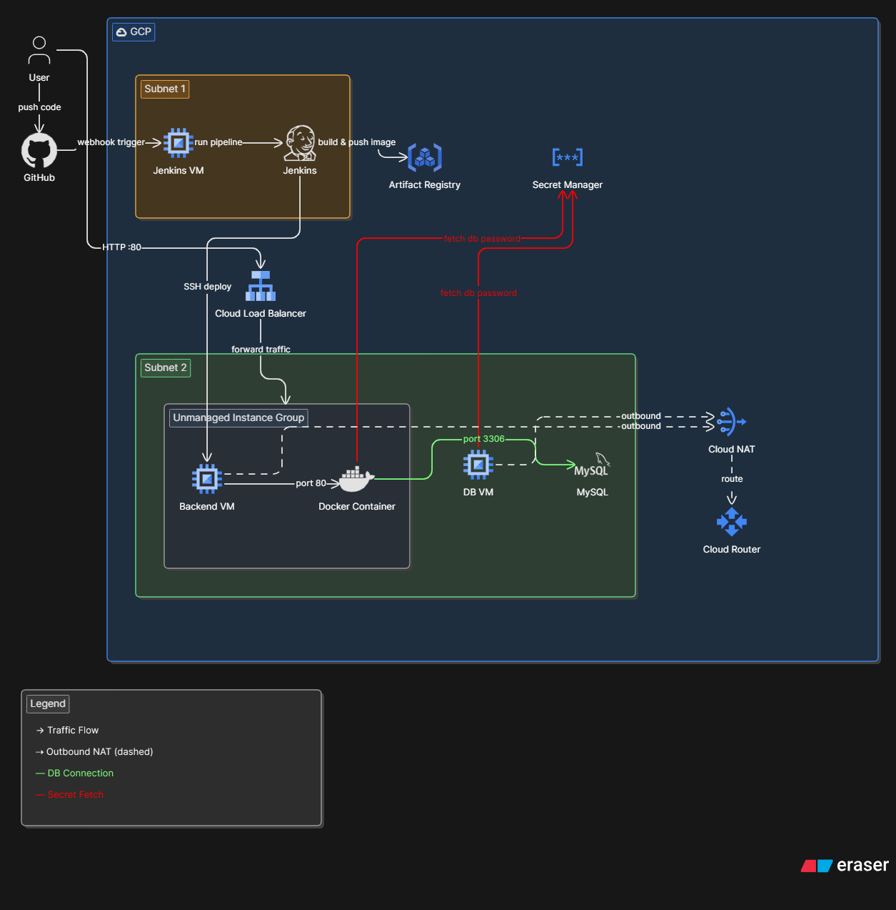

# ☁️ Java Backend — GCP 3-Tier Infrastructure

> Terraform-provisioned infrastructure on Google Cloud Platform for deploying a Dockerized Java backend with a managed MySQL database, Jenkins CI/CD pipeline, and secure networking.

---

## 🏗️ Architecture Overview



The infrastructure is split across **two subnets** inside a custom GCP VPC:

### Subnet 1 — CI/CD Layer
| Component | Role |
|---|---|
| **Jenkins VM** | Hosts the Jenkins server; triggered via GitHub webhook |
| **Jenkins** | Builds Docker image and pushes it to Artifact Registry |
| **Artifact Registry** | Stores versioned Docker images of the Java backend |
| **Secret Manager** | Securely stores and serves the MySQL DB password |

### Subnet 2 — Application Layer
| Component | Role |
|---|---|
| **Backend VM** | Runs the Dockerized Java application on port 80 |
| **Docker Container** | Java backend container pulled from Artifact Registry |
| **DB VM** | Hosts MySQL database, accessible on port 3306 |
| **MySQL** | Primary database for the Java backend |
| **Cloud Load Balancer** | Distributes incoming HTTP :80 traffic to the backend |
| **Cloud NAT + Cloud Router** | Provides outbound internet access for private VMs |

---

## 🔄 CI/CD Flow

```
User pushes code to GitHub
        │
        ▼
GitHub Webhook triggers Jenkins VM
        │
        ▼
Jenkins builds & pushes Docker image → Artifact Registry
        │
        ▼
Jenkins SSH deploys to Backend VM
        │
        ▼
Backend VM pulls image, fetches DB password from Secret Manager
        │
        ▼
Docker container connects to MySQL on port 3306
```

---

## 📁 Project Structure

```
java-infra/
├── vpc/                    # VPC, subnets, firewall rules
│   ├── main.tf
│   ├── variable.tf
│   ├── output.tf
│   └── provider.tf
│
├── java/                   # Backend VM + DB VM provisioning
│   ├── main.tf
│   ├── variable.tf
│   ├── output.tf
│   ├── docker.sh           # Docker setup script for Backend VM
│   └── mysql.sh            # MySQL setup script for DB VM
│
├── jenkins/                # Jenkins VM provisioning
│   ├── main.tf
│   ├── variables.tf
│   ├── output.tf
│   └── jenkins.sh          # Jenkins installation script
│
└── .gitignore
```

---

## 🚀 Getting Started

### Prerequisites
- [Terraform](https://developer.hashicorp.com/terraform/install) >= 1.0
- [Google Cloud SDK](https://cloud.google.com/sdk/docs/install)
- A GCP project with billing enabled
- GCP credentials configured: \`gcloud auth application-default login\`

### Deploy

```bash
# 1. Provision the VPC first
cd vpc/
terraform init
terraform apply

# 2. Deploy Jenkins VM
cd ../jenkins/
terraform init
terraform apply

# 3. Deploy Java backend and DB VMs
cd ../java/
terraform init
terraform apply
```

---

## 🔐 Security Highlights

- DB VM has **no public IP** — only accessible within Subnet 2 via port 3306
- MySQL password stored in **GCP Secret Manager**, never hardcoded
- Outbound traffic from private VMs routed through **Cloud NAT**
- Jenkins communicates with Backend VM via **SSH deploy**

---

## 📌 Networking Summary

| Resource | CIDR / Port | Notes |
|---|---|---|
| Subnet 1 | CI/CD subnet | Jenkins VM |
| Subnet 2 | App subnet | Backend VM + DB VM |
| Load Balancer | HTTP :80 | Public entry point |
| MySQL | Port 3306 | Internal only |
| Cloud NAT | Outbound | Private VM internet access |

---

## 🛠️ Tech Stack

- **Infrastructure:** Terraform, GCP
- **CI/CD:** Jenkins, GitHub Webhooks
- **Runtime:** Docker, Java
- **Database:** MySQL
- **Registry:** GCP Artifact Registry
- **Secrets:** GCP Secret Manager
- **Networking:** VPC, Cloud Load Balancer, Cloud NAT, Cloud Router
